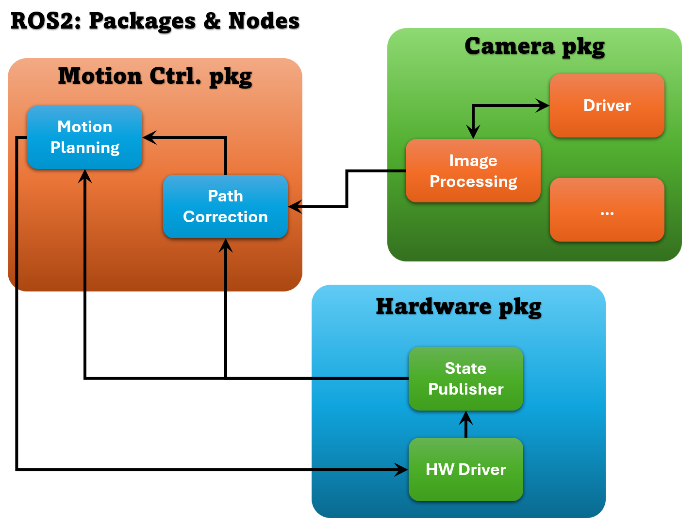
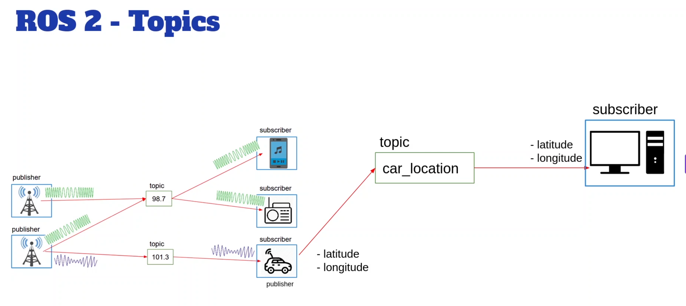

# ROS 2 Workspace

This is a ROS 2 workspace containing custom packages for ROS Jazzy.

## Table of contents

- Learning manual: from first node to a running system
  - Step 0: Set up the environment (Docker or local)
  - Step 1: Create a package (Python)
  - Step 2: Write a publisher node
  - Step 3: Write a subscriber node
  - Step 4: Register executables (so ros2 run works)
  - Step 5: Build and source with colcon
  - Step 6: Run and inspect topics
  - Step 7: Remap names and use namespaces
  - Step 8: Launch files (run multiple nodes together)
  - Step 9: Record and replay with ros2 bag
  - Step 10: Visualize with rqt and rqt_graph
- Appendices (deep dives and references)
  - Appendix A: CLI Commands Reference
  - Appendix B: Topics Deep Dive
  - Appendix C: Node naming and remapping
  - Appendix D: Registering executables for ros2 run (Python and C++)
  - Appendix E: RQT and visualization tools
  - Appendix F: Example architecture (illustrative)

## Setup

### Prerequisites

- Docker with NVIDIA Container Toolkit (for GPU support)
- ROS 2 Jazzy

### Quick Start with Docker

1. **Build the Docker image:**

   ```bash
   ./build.sh
   ```

2. **Run the container:**

   ```bash
   ./run.sh
   ```

3. **Build the workspace (inside container):**

   ```bash
   /home/ROS2/build_workspace.sh
   ```

### Manual Setup (without Docker)

1. **Source ROS 2:**

   ```bash
   source /opt/ros/jazzy/setup.bash
   ```

2. **Build the workspace:**

   ```bash
   cd ros2_ws
   colcon build
   ```

3. **Source the workspace:**

   ```bash
   source install/setup.bash
   ```

## Learning manual: from first node to a running system

Follow these steps in order. Each step is small and practical. Code and commands are minimal and copy-paste friendly.

### Step 0: Set up the environment (Docker or local)

- Docker (recommended): use the Quick Start above (build.sh, run.sh). Inside the container, your workspace is under `/home/ROS2/`.
- Local: install ROS 2 Jazzy and source `/opt/ros/jazzy/setup.bash` before building.

### Step 1: Create a package (Python)

```bash
cd ros2_ws/src
ros2 pkg create my_py_pkg --build-type ament_python --dependencies rclpy std_msgs
```

This generates a Python package with boilerplate files.

### Step 2: Write a publisher node

Create `ros2_ws/src/my_py_pkg/my_py_pkg/talker.py`:

```python
import rclpy
from rclpy.node import Node
from std_msgs.msg import String


class Talker(Node):
  def __init__(self):
    super().__init__('talker')
    self.pub = self.create_publisher(String, 'chatter', 10)
    self.timer = self.create_timer(0.5, self.publish)

  def publish(self):
    msg = String()
    msg.data = 'hello from talker'
    self.pub.publish(msg)
    self.get_logger().info(f'Publishing: {msg.data}')


def main(args=None):
  rclpy.init(args=args)
  node = Talker()
  rclpy.spin(node)
  rclpy.shutdown()


if __name__ == '__main__':
  main()
```

### Step 3: Write a subscriber node

Create `ros2_ws/src/my_py_pkg/my_py_pkg/listener.py`:

```python
import rclpy
from rclpy.node import Node
from std_msgs.msg import String


class Listener(Node):
  def __init__(self):
    super().__init__('listener')
    self.sub = self.create_subscription(String, 'chatter', self.cb, 10)

  def cb(self, msg: String):
    self.get_logger().info(f'Received: {msg.data}')


def main(args=None):
  rclpy.init(args=args)
  node = Listener()
  rclpy.spin(node)
  rclpy.shutdown()


if __name__ == '__main__':
  main()
```

### Step 4: Register executables (so `ros2 run` works)

Edit `ros2_ws/src/my_py_pkg/setup.py` and add console scripts:

```python
from setuptools import setup

setup(
  name='my_py_pkg',
  # ... other setup args ...
  entry_points={
    'console_scripts': [
      'talker = my_py_pkg.talker:main',
      'listener = my_py_pkg.listener:main',
    ],
  },
)
```

Also ensure runtime dependencies in `ros2_ws/src/my_py_pkg/package.xml`:

```xml
<exec_depend>rclpy</exec_depend>
<exec_depend>std_msgs</exec_depend>
```

### Step 5: Build and source with colcon

```bash
cd ~/Github/ROS2/ros2_ws
colcon build --packages-select my_py_pkg
source install/setup.bash
```

### Step 6: Run and inspect topics

```bash
# Terminal 1
ros2 run my_py_pkg talker

# Terminal 2
ros2 run my_py_pkg listener

# Inspect
ros2 topic list -t
ros2 topic echo /chatter
```

### Step 7: Remap names and use namespaces

```bash
# Remap topic name
ros2 run my_py_pkg talker --ros-args --remap chatter:=/robot1/chatter

# Apply a namespace to a node
ros2 run my_py_pkg listener --ros-args --remap __ns:=/robot1
```

### Step 8: Launch files (run multiple nodes together)

Create `ros2_ws/src/my_py_pkg/launch/talk_listen.launch.py`:

```python
from launch import LaunchDescription
from launch_ros.actions import Node


def generate_launch_description():
  return LaunchDescription([
    Node(package='my_py_pkg', executable='talker'),
    Node(package='my_py_pkg', executable='listener')
  ])
```

Run it:

```bash
ros2 launch my_py_pkg talk_listen.launch.py
```

### Step 9: Record and replay with ros2 bag

```bash
ros2 bag record /chatter -o demo_bag
ros2 bag play demo_bag
```

### Step 10: Visualize with rqt and rqt_graph

```bash
rqt_graph   # visualize nodes and topics
rqt_topic   # inspect and publish messages
```

## Packages

### my_cpp_pkg

A C++ package demonstrating basic ROS 2 functionality.

## Appendix F: Example architecture (illustrative)



_Note: This diagram is illustrative — it shows example roles and connections, not a definitive or exhaustive design._

This workspace is designed to implement a multi-package ROS 2 system with the following architecture:

### Package Structure & Node Communication

The system consists of three main packages, each containing specialized nodes:

#### 1. **Motion Planning Package**

- **Motion Planning Node**: Core path planning algorithms
- **Path Correction Node**: Real-time path adjustments based on feedback
- Communicates with camera package for environmental awareness
- Sends commands to hardware control package

#### 2. **Camera Package**

- **Camera Driver Node**: Hardware interface for camera sensors
- **Image Processing Node**: Computer vision algorithms for environment perception
- Additional nodes (...)  for extended functionality
- Provides visual feedback to motion planning for obstacle avoidance and navigation

#### 3. **Hardware Control Package**

- **Hardware Driver Node**: Low-level hardware interface
- **State Publisher Node**: Publishes robot state information
- Receives motion commands from planning package
- Provides feedback to motion planning for closed-loop control

### Communication Flow

1. **Sensor Data**: Camera driver captures environmental data
2. **Processing**: Image processing node extracts relevant information
3. **Planning**: Motion planning uses visual data to generate paths
4. **Correction**: Path correction adjusts plans based on real-time feedback
5. **Execution**: Hardware driver executes motion commands
6. **Feedback**: State publisher provides current robot state back to planners

This distributed architecture ensures modularity, fault tolerance, and scalability while maintaining real-time performance for robotic applications.

## Workspace Structure

```text
ros2_ws/
├── src/
│   └── my_cpp_pkg/
├── build/
├── install/
└── log/
```

## Development

- Source code is located in `ros2_ws/src/`
- Build artifacts are in `ros2_ws/build/` and `ros2_ws/install/`
- Use `colcon build` to build all packages
- Use `colcon build --packages-select <package_name>` to build specific packages

## Docker Environment

The Docker container includes:

- ROS 2 Jazzy
- Development tools (cmake, ninja, gcc, clang, etc.)
- Code analysis tools (cppcheck, clang-tidy, etc.)
- Debugging tools (gdb)
- Documentation tools (doxygen)
- Text editors (vim, nano, gedit)
- GPU support (NVIDIA)

## Appendix B: Topics Deep Dive (Publishers and Subscribers)



_Note: The diagram and examples are illustrative to explain concepts quickly; adapt names and message types to your project._

ROS 2 topics are the primary communication mechanism for real-time data exchange between nodes. They implement a publish-subscribe pattern where nodes can publish data to topics and subscribe to receive data from topics.

### Understanding Topics

Topics are **named channels** that carry messages of a specific type. They enable:

- **Decoupled communication**: Publishers and subscribers don't need to know about each other
- **Many-to-many communication**: Multiple publishers and subscribers can use the same topic
- **Asynchronous messaging**: Non-blocking communication between nodes
- **Type safety**: Each topic has a defined message type

### Key Concepts

#### Publishers

Nodes that **send data** to topics:

```bash
# Example: A camera node publishing image data
ros2 run camera_package camera_node  # Publishes to /camera/image_raw
```

#### Subscribers

Nodes that **receive data** from topics:

```bash
# Example: An image processing node subscribing to camera data
ros2 run vision_package image_processor  # Subscribes to /camera/image_raw
```

#### Topic Names

Topics follow a hierarchical naming convention:

```bash
/robot/sensors/camera/image      # Hierarchical namespace
/cmd_vel                         # Simple name
/robot1/odom                     # Robot-specific namespace
```

### Working with Topics

#### List All Active Topics

```bash
ros2 topic list                 # Show all topics
ros2 topic list -t              # Show topics with message types
ros2 topic list --verbose       # Detailed information
```

#### Get Topic Information

```bash
ros2 topic info /topic_name     # Show publishers and subscribers
ros2 topic info /cmd_vel        # Example for velocity commands
ros2 topic type /topic_name     # Show message type only
ros2 topic hz /topic_name       # Show publishing frequency
```

#### Monitor Topic Data

```bash
ros2 topic echo /topic_name     # Display messages in real-time
ros2 topic echo /cmd_vel        # Monitor velocity commands
ros2 topic echo /scan --qos-profile sensor_data  # With QoS profile
```

#### Publish to Topics Manually

```bash
# Basic publishing
ros2 topic pub /topic_name msg_type "data"

# Publish velocity command
ros2 topic pub /cmd_vel geometry_msgs/msg/Twist "
linear:
  x: 1.0
  y: 0.0
  z: 0.0
angular:
  x: 0.0
  y: 0.0
  z: 0.5"

# Publish once and exit
ros2 topic pub --once /topic_name msg_type "data"

# Publish at specific rate (10 Hz)
ros2 topic pub --rate 10 /topic_name msg_type "data"
```

### Advanced Topic Operations

#### Changing Topic Names on the Fly

##### Command Line Remapping

```bash
# Remap topic when launching a node
ros2 run package_name node_name --ros-args --remap old_topic:=new_topic

# Example: Change cmd_vel to robot1/cmd_vel
ros2 run teleop_twist_keyboard teleop_twist_keyboard --ros-args --remap cmd_vel:=robot1/cmd_vel

# Multiple remappings
ros2 run my_package my_node --ros-args \
  --remap input_topic:=new_input \
  --remap output_topic:=new_output
```

##### Launch File Remapping

```python
# In a launch file
from launch import LaunchDescription
from launch_ros.actions import Node

def generate_launch_description():
    return LaunchDescription([
        Node(
            package='my_package',
            executable='my_node',
            remappings=[
                ('old_topic', 'new_topic'),
                ('cmd_vel', 'robot1/cmd_vel')
            ]
        )
    ])
```

##### Namespace Remapping

```bash
# Apply namespace to all topics
ros2 run package_name node_name --ros-args --remap __ns:=/robot1

# This changes /cmd_vel to /robot1/cmd_vel automatically
```

#### Topic Bridging and Relay

```bash
# Bridge between different topic names
ros2 run topic_tools relay source_topic target_topic

# Example: Bridge cmd_vel to robot_cmd_vel
ros2 run topic_tools relay /cmd_vel /robot_cmd_vel
```

#### Quality of Service (QoS) Profiles

```bash
# Publish with specific QoS
ros2 topic pub /topic_name msg_type "data" --qos-profile sensor_data
ros2 topic pub /topic_name msg_type "data" --qos-reliability reliable
ros2 topic pub /topic_name msg_type "data" --qos-durability transient_local

# Available QoS profiles:
# - sensor_data: Best effort, volatile
# - system_default: Reliable, volatile  
# - parameter_events: Reliable, volatile
# - services_default: Reliable, volatile
```

### Topic Discovery and Debugging

#### Find Message Structure

```bash
ros2 interface show geometry_msgs/msg/Twist    # Show message definition
ros2 interface list                            # List all message types
ros2 interface package geometry_msgs           # Show package interfaces
```

#### Topic Performance Analysis

```bash
ros2 topic hz /topic_name              # Publishing frequency
ros2 topic bw /topic_name              # Bandwidth usage
ros2 topic delay /topic_name           # Message latency
ros2 topic find msg_type               # Find topics of specific type
```

#### Debugging Connection Issues

```bash
# Check if topic exists
ros2 topic list | grep topic_name

# Check publishers and subscribers
ros2 topic info /topic_name

# Monitor topic activity
ros2 topic echo /topic_name --no-arr   # Without arrays
ros2 topic echo /topic_name --field data.position  # Specific field only
```

### Practical Examples

#### Robot Teleoperation

```bash
# Terminal 1: Start turtlesim
ros2 run turtlesim turtlesim_node

# Terminal 2: Manual control
ros2 topic pub --rate 1 /turtle1/cmd_vel geometry_msgs/msg/Twist "
linear:
  x: 2.0
angular:
  z: 1.8"

# Terminal 3: Monitor position
ros2 topic echo /turtle1/pose
```

#### Multi-Robot Setup

```bash
# Robot 1 namespace
ros2 run turtlesim turtlesim_node --ros-args --remap __ns:=/robot1

# Robot 2 namespace  
ros2 run turtlesim turtlesim_node --ros-args --remap __ns:=/robot2

# Control robot 1
ros2 topic pub /robot1/turtle1/cmd_vel geometry_msgs/msg/Twist "..."

# Control robot 2
ros2 topic pub /robot2/turtle1/cmd_vel geometry_msgs/msg/Twist "..."
```

### Recording and Playback (examples)

```bash
# Record topics to bag file
ros2 bag record /topic1 /topic2 -o my_recording

# Record all topics
ros2 bag record -a

# Playback recorded data
ros2 bag play my_recording
```

### Common Message Types

#### Geometry Messages

```bash
geometry_msgs/msg/Twist        # Velocity (linear + angular)
geometry_msgs/msg/Pose         # Position + orientation
geometry_msgs/msg/PoseStamped  # Pose with timestamp
geometry_msgs/msg/Point        # 3D point
```

#### Sensor Messages

```bash
sensor_msgs/msg/Image          # Camera images
sensor_msgs/msg/LaserScan      # Lidar data
sensor_msgs/msg/Imu            # IMU sensor data
sensor_msgs/msg/PointCloud2    # 3D point clouds
```

#### Standard Messages

```bash
std_msgs/msg/String            # Text data
std_msgs/msg/Int32             # Integer numbers
std_msgs/msg/Float64           # Floating point numbers
std_msgs/msg/Bool              # Boolean values
```

### Best Practices

1. **Use meaningful topic names**: `/robot/sensors/camera/image` instead of `/cam`
2. **Follow naming conventions**: Use lowercase with underscores
3. **Choose appropriate QoS**: Sensor data vs. command data have different requirements
4. **Monitor topic frequency**: Ensure publishers match expected rates
5. **Use namespaces**: For multi-robot systems or component organization
6. **Document topic interfaces**: Clearly specify message types and semantics

## Appendix A: ROS 2 CLI Commands Reference

ROS 2 provides a comprehensive command-line interface for interacting with the ROS ecosystem. Here are the essential commands:

### Core Commands

#### `ros2 run`

Execute a specific node from a package:

```bash
ros2 run <package_name> <executable_name>
ros2 run my_py_pkg my_first_node
ros2 run demo_nodes_cpp talker
```

#### `ros2 launch`

Launch multiple nodes and configure complex systems:

```bash
ros2 launch <package_name> <launch_file>
ros2 launch demo_nodes_cpp talker_listener.launch.py
```

#### `ros2 pkg`

Package management and information:

```bash
ros2 pkg list                    # List all packages
ros2 pkg create <pkg_name>       # Create new package
ros2 pkg prefix <pkg_name>       # Show package installation path
ros2 pkg executables <pkg_name>  # List executables in package
```

### Communication Commands

#### `ros2 topic`

Manage and inspect ROS topics:

```bash
ros2 topic list                  # List all active topics
ros2 topic echo <topic_name>     # Display messages on topic
ros2 topic info <topic_name>     # Show topic information
ros2 topic hz <topic_name>       # Show publishing frequency
ros2 topic pub <topic> <msg_type> <data>  # Publish to topic
ros2 topic bw <topic_name>       # Show bandwidth usage
```

#### `ros2 service`

Interact with ROS services:

```bash
ros2 service list                # List all services
ros2 service call <service> <srv_type> <data>  # Call a service
ros2 service type <service>      # Show service type
ros2 service find <srv_type>     # Find services of specific type
```

#### `ros2 action`

Work with ROS actions (goal-oriented tasks):

```bash
ros2 action list                 # List all action servers
ros2 action info <action>        # Show action information
ros2 action send_goal <action> <action_type> <goal>  # Send goal
```

### Node Management

#### `ros2 node`

Inspect and manage running nodes:

```bash
ros2 node list                   # List all running nodes
ros2 node info <node_name>       # Show node details
ros2 node kill <node_name>       # Terminate a node
```

### Interface Commands

#### `ros2 interface`

Examine message, service, and action definitions:

```bash
ros2 interface list              # List all interfaces
ros2 interface show <interface>  # Show interface definition
ros2 interface package <pkg>     # Show interfaces in package
ros2 interface packages          # List packages with interfaces
```

### Parameter Management

#### `ros2 param`

Configure node parameters:

```bash
ros2 param list                  # List all parameters
ros2 param get <node> <param>    # Get parameter value
ros2 param set <node> <param> <value>  # Set parameter value
ros2 param dump <node>           # Export all parameters
ros2 param load <node> <file>    # Load parameters from file
```

### Recording and Playback (ros2 bag)

#### `ros2 bag`

Record and replay ROS data:

```bash
ros2 bag record <topic1> <topic2>  # Record specific topics
ros2 bag record -a               # Record all topics
ros2 bag play <bag_file>         # Replay recorded data
ros2 bag info <bag_file>         # Show bag information
ros2 bag reindex <bag_file>      # Reindex corrupted bag
```

### System Information

#### `ros2 doctor`

Diagnose ROS 2 setup and configuration:

```bash
ros2 doctor                      # Check system health
ros2 doctor --report             # Generate detailed report
```

#### `ros2 wtf`

Show comprehensive system status (What's This For?):

```bash
ros2 wtf                         # Display system overview
```

### Debugging and Development

#### `ros2 component`

Manage component-based nodes:

```bash
ros2 component list              # List component containers
ros2 component types             # Show available component types
ros2 component load <container> <component>  # Load component
```

#### `ros2 lifecycle`

Control lifecycle nodes:

```bash
ros2 lifecycle list              # List lifecycle nodes
ros2 lifecycle get <node>        # Get current state
ros2 lifecycle set <node> <state>  # Change node state
```

### Visualization and GUI Tools

#### `rqt`

RQT is the main GUI framework for ROS 2, providing a plugin-based interface for various tools:

```bash
rqt                              # Launch RQT with plugin selection
rqt --list-plugins               # List available plugins
rqt --standalone <plugin_name>   # Launch specific plugin directly
```

**Common RQT Plugins:**

- **rqt_graph**: Visualize node and topic connections
- **rqt_plot**: Real-time data plotting
- **rqt_console**: View log messages
- **rqt_service_caller**: Call services with GUI
- **rqt_topic**: Topic monitoring and publishing
- **rqt_bag**: Bag file viewer and player
- **rqt_tf_tree**: Transform tree visualization
- **rqt_image_view**: Display camera feeds

#### `rqt_graph`

Visualize the ROS computation graph (nodes, topics, services):

```bash
rqt_graph                        # Launch node/topic graph
rqt_graph --force-discover       # Force discovery of all connections
```

**Features:**

- **Node View**: Shows running nodes and their connections
- **Topic View**: Displays topics and their publishers/subscribers
- **Service View**: Visualizes service connections
- **Action View**: Shows action servers and clients

**Usage Examples:**

1. **Basic Graph Visualization:**

   ```bash
   # Terminal 1: Start some demo nodes
   ros2 run demo_nodes_cpp talker
   
   # Terminal 2: Start listener
   ros2 run demo_nodes_cpp listener
   
   # Terminal 3: Launch graph viewer
   rqt_graph
   ```

2. **Analyze Complex Systems:**

   ```bash
   # Launch a complex system (e.g., navigation stack)
   ros2 launch nav2_bringup tb3_simulation_launch.py
   
   # View the computation graph
   rqt_graph
   ```

3. **Filter Graph View:**
   - Use the GUI filters to show/hide:
     - Dead sinks (nodes with no outputs)
     - Leaf topics (topics with no subscribers)
     - Debug nodes
     - Specific namespaces

#### Other Useful RQT Tools

**rqt_plot - Real-time Data Visualization:**

```bash
rqt_plot                         # Launch plotting interface
rqt_plot /topic_name/field       # Plot specific message field
rqt_plot /turtle1/pose/x /turtle1/pose/y  # Plot multiple fields
```

**rqt_console - Log Message Viewer:**

```bash
rqt_console                      # View system log messages
```

- Filter by severity (Debug, Info, Warn, Error, Fatal)
- Filter by node name
- Search log messages

**rqt_service_caller - Service GUI:**

```bash
rqt_service_caller               # GUI for calling services
```

**rqt_topic - Topic Monitor:**

```bash
rqt_topic                        # Monitor and publish to topics
```

**rqt_bag - Bag File Viewer:**

```bash
rqt_bag <bag_file>               # View and analyze bag files
```

**rqt_image_view - Camera Feed Viewer:**

```bash
rqt_image_view                   # Display camera topics
```

### RQT Integration Examples

**Complete Debugging Session:**

```bash
# 1. Start your nodes
ros2 run my_package my_node

# 2. Check the computation graph
rqt_graph

# 3. Monitor log messages
rqt_console

# 4. Plot sensor data
rqt_plot /sensor_data/temperature

# 5. View camera feed (if available)
rqt_image_view

# 6. All-in-one dashboard
rqt  # Then add multiple plugins in tabs/docks
```

**Custom RQT Perspective:**
RQT allows you to save custom layouts (perspectives) with multiple plugins:

1. Launch `rqt`
2. Add desired plugins (Plugins menu)
3. Arrange them in tabs or docked windows
4. Save perspective: Perspectives → Create Perspective
5. Load later: Perspectives → Import/Export

## **🚀 NODE NAMING AND REMAPPING - CRITICAL FOR MULTI-INSTANCE DEPLOYMENTS**

### **Why This Matters**

When deploying real robotics systems, you often need **multiple instances of the same node** - like multiple temperature sensors, cameras, or motors. ROS 2 provides powerful remapping capabilities to handle this elegantly.

### **🔧 Node Name Remapping**

#### **Method 1: Change Node Name at Launch**

```bash
# Run the same node with different names
ros2 run <package> <executable> --ros-args --remap __node:=<new_name>

# Example: Multiple temperature sensors
ros2 run sensor_pkg temp_sensor --ros-args --remap __node:=temp_sensor_kitchen
ros2 run sensor_pkg temp_sensor --ros-args --remap __node:=temp_sensor_bedroom
ros2 run sensor_pkg temp_sensor --ros-args --remap __node:=temp_sensor_garage
```

#### **Method 2: Topic and Service Remapping**

```bash
# Remap topics for different sensor instances
ros2 run sensor_pkg temp_sensor --ros-args \
  --remap __node:=temp_sensor_1 \
  --remap temperature:=kitchen/temperature \
  --remap /diagnostics:=/kitchen/diagnostics

ros2 run sensor_pkg temp_sensor --ros-args \
  --remap __node:=temp_sensor_2 \
  --remap temperature:=bedroom/temperature \
  --remap /diagnostics:=/bedroom/diagnostics
```

### **🏗️ Namespace-Based Organization**

#### **Using Namespaces for Clean Separation**

```bash
# Launch nodes in different namespaces
ros2 run sensor_pkg temp_sensor --ros-args --remap __ns:=/kitchen
ros2 run sensor_pkg temp_sensor --ros-args --remap __ns:=/bedroom
ros2 run sensor_pkg temp_sensor --ros-args --remap __ns:=/garage

# This creates:
# /kitchen/temp_sensor node publishing to /kitchen/temperature
# /bedroom/temp_sensor node publishing to /bedroom/temperature  
# /garage/temp_sensor node publishing to /garage/temperature
```

#### **Combined Namespace + Node Naming**

```bash
# Ultimate flexibility: namespace + custom node name
ros2 run sensor_pkg temp_sensor --ros-args \
  --remap __ns:=/sensors \
  --remap __node:=kitchen_temp \
  --remap temperature:=kitchen_data

# Result: /sensors/kitchen_temp node publishing to /sensors/kitchen_data
```

### **📊 Real-World Example: Multi-Camera System**

```bash
# Terminal 1: Front camera
ros2 run camera_pkg camera_driver --ros-args \
  --remap __node:=front_camera \
  --remap image_raw:=front/image_raw \
  --remap camera_info:=front/camera_info

# Terminal 2: Back camera  
ros2 run camera_pkg camera_driver --ros-args \
  --remap __node:=back_camera \
  --remap image_raw:=back/image_raw \
  --remap camera_info:=back/camera_info

# Terminal 3: Left camera
ros2 run camera_pkg camera_driver --ros-args \
  --remap __node:=left_camera \
  --remap image_raw:=left/image_raw \
  --remap camera_info:=left/camera_info

# Now you have 3 distinct camera nodes with organized topics!
```

### **⚡ Dynamic Parameter Configuration**

#### **Set Different Parameters per Instance**

```bash
# Temperature sensor with different configurations
ros2 run sensor_pkg temp_sensor --ros-args \
  --remap __node:=high_precision_temp \
  --param sampling_rate:=100.0 \
  --param precision:=high

ros2 run sensor_pkg temp_sensor --ros-args \
  --remap __node:=low_power_temp \
  --param sampling_rate:=1.0 \
  --param precision:=low \
  --param power_mode:=eco
```

### **🎯 Launch File Integration**

#### **Scaling with Launch Files**

```python
# launch/multi_sensors.launch.py
from launch import LaunchDescription
from launch_ros.actions import Node

def generate_launch_description():
    return LaunchDescription([
        Node(
            package='sensor_pkg',
            executable='temp_sensor',
            name='kitchen_temp',
            namespace='sensors',
            remappings=[
                ('temperature', 'kitchen/temp'),
                ('status', 'kitchen/status')
            ],
            parameters=[{'sampling_rate': 10.0}]
        ),
        Node(
            package='sensor_pkg', 
            executable='temp_sensor',
            name='bedroom_temp',
            namespace='sensors',
            remappings=[
                ('temperature', 'bedroom/temp'),
                ('status', 'bedroom/status')  
            ],
            parameters=[{'sampling_rate': 5.0}]
        )
    ])
```

### **🔍 Verification Commands**

```bash
# Check all running nodes
ros2 node list

# Check topics from each instance
ros2 topic list | grep temperature

# Monitor specific sensor
ros2 topic echo /kitchen/temperature

# Check node information  
ros2 node info /sensors/kitchen_temp

# Verify remappings worked
rqt_graph  # Visual verification
```

### **💡 Pro Tips for Multi-Instance Deployments**

1. **Consistent Naming Convention:**

   ```bash
   # Good: Predictable patterns
   /sensors/kitchen_temp, /sensors/bedroom_temp
   
   # Bad: Inconsistent naming  
   /temp1, /kitchen_sensor, /bedroom_temperature_node
   ```

2. **Use Namespaces for Grouping:**

   ```bash
   # Group related sensors
   /sensors/kitchen_temp
   /sensors/kitchen_humidity
   /sensors/kitchen_pressure
   ```

3. **Parameter Files for Complex Configs:**

   ```bash
   ros2 run sensor_pkg temp_sensor --ros-args \
     --params-file config/kitchen_sensor.yaml \
     --remap __node:=kitchen_temp
   ```

4. **Service Remapping Too:**

   ```bash
   ros2 run sensor_pkg temp_sensor --ros-args \
     --remap __node:=kitchen_temp \
     --remap calibrate:=kitchen/calibrate_sensor
   ```

## Registering executables for ros2 run (Python and C++)

To run a node with:

```bash
ros2 run <package_name> <executable_name>
```

you must register that executable in your package’s build files. Below are minimal, working patterns for Python and C++ packages.

### Python package (ament_python)

1. Ensure your node has a callable `main()` in the module:

```python
# camera_pkg/transmission.py

def main():
    # create node and spin
    ...
```

1. Add a console entry point in `setup.py`:

```python
from setuptools import setup

setup(
    name='camera_pkg',
    # ... other setup args ...
    entry_points={
        'console_scripts': [
            'camera_transmission = camera_pkg.transmission:main',
            # 'name-you-type'   = python_dotted_path:callable
        ],
    },
)
```

1. Declare runtime deps (example) in `package.xml`:

```xml
<exec_depend>rclpy</exec_depend>
<exec_depend>example_interfaces</exec_depend>
```

1. Build and source:

```bash
colcon build --packages-select camera_pkg
source install/setup.bash
```

1. Run:

```bash
ros2 run camera_pkg camera_transmission
```

Notes:

- The executable name is the left side of the entry (`camera_transmission`).
- The right side must resolve to `package.module:function` in your source tree.
- No need to chmod the Python file when using console_scripts.

### C++ package (ament_cmake)

1. Register the target and install it in `CMakeLists.txt`:

```cmake
add_executable(talker src/talker.cpp)
ament_target_dependencies(talker rclcpp std_msgs)
install(TARGETS talker DESTINATION lib/${PROJECT_NAME})
```

1. Declare runtime deps in `package.xml`:

```xml
<exec_depend>rclcpp</exec_depend>
<exec_depend>std_msgs</exec_depend>
```

1. Build and source:

```bash
colcon build --packages-select my_cpp_pkg
source install/setup.bash
```

1. Run:

```bash
ros2 run my_cpp_pkg talker
```

### Verify executables are visible

```bash
ros2 pkg executables <package_name>
# Example
ros2 pkg executables camera_pkg
```
